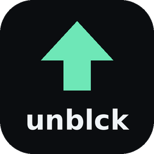

<p align="center"></p>

<p align="center">
<a href="https://marketplace.visualstudio.com/items?itemName=unblck.ship-your-site"></a>
<a href="https://open-vsx.org/extension/unblck/ship-your-site"></a>
<a href="https://unblck.me/discord"></a>
</p>

# Ship your site

**Take a site that works on `localhost` and make it live for everyone at `https://yourname.com`.** A free, step-by-step guide packaged as an agent skill, so your AI coding agent (Cursor, Claude Code, Codex, Copilot and others) can walk you through it. By unblck.me.

## What it does

Your agent guides you one step at a time, checking each step before moving on:

1. **Get something deployable**: detect your framework, build it, find the right output folder, and make sure no secrets are inside.
2. **Set up Netlify**: create a free account (and understand the credit-based Free plan so you don't run out).
3. **Deploy** to a `*.netlify.app` URL by drag and drop, the Netlify CLI, or a Git repo, including the single-page-app rewrite so refreshing `/about` doesn't 404.
4. **Make the project public**: Netlify teams created since July 28, 2026 make new projects private by default, which is the #1 reason a site "works for me but not for my friends".
5. **Buy a domain**: what to compare (renewal price, WHOIS privacy, DNS control) across Netlify, Cloudflare Registrar and retail registrars.
6. **Connect the domain and set up DNS**: Netlify DNS (nameservers) or external DNS (records), apex vs `www`, and the classic traps: lost email (MX records), DNSSEC, Cloudflare's orange cloud, CAA records, leftover parking-page records.
7. **HTTPS**: the free Let's Encrypt certificate Netlify issues, and what to do when it's stuck.
8. **Verify it's actually public**: `dig` and `curl` checks from outside your own machine, plus a troubleshooting table for the most common failures.

The agent **asks before any purchase or account action** (buying a domain, signing up, production deploys, visibility or DNS changes), and never asks you to paste passwords, card details or tokens into chat.

Prefer to read it yourself? The full guide is in [skills/ship-your-site/references/GUIDE.md](skills/ship-your-site/references/GUIDE.md).

## Install

### Any agent, via skills.sh (Cursor, Claude Code, Codex, Copilot, Gemini CLI, Windsurf and more)

```bash
npx skills add unblck/ship-your-site
```

### Claude Code plugin

Inside Claude Code:

```text
/plugin marketplace add unblck/ship-your-site
/plugin install ship-your-site@unblck
```

Or from your shell:

```bash
claude plugin marketplace add unblck/ship-your-site
claude plugin install ship-your-site@unblck
```

### Cursor

- **Plugin:** in Cursor, open **Customize**, choose **From GitHub Repository**, and paste `https://github.com/unblck/ship-your-site`. This installs the skill plus a Cursor rule.
- **Skill only:** `npx skills add unblck/ship-your-site` (above) also installs it for Cursor.

### VS Code / Cursor extension (walkthrough + Copilot skill)

**VS Code:** install [Ship your site from the VS Code Marketplace](https://marketplace.visualstudio.com/items?itemName=unblck.ship-your-site), search for **Ship your site** by **unblck.me** in the Extensions view, or run `ext install unblck.ship-your-site` from Quick Open.

**Cursor, Windsurf, VSCodium:** install [Ship your site from Open VSX](https://open-vsx.org/extension/unblck/ship-your-site), or search for **Ship your site** in the Extensions view. Fallback: download `ship-your-site-1.0.0.vsix` from the [v1.0.0 release](https://github.com/unblck/ship-your-site/releases/tag/v1.0.0) and use **Extensions → ⋯ → Install from VSIX…**.

The extension adds a Getting Started walkthrough that mirrors the guide, and registers the skill for Copilot Chat.

## Use it

Open your project and ask your agent something like:

- "Help me put this site online with my own domain."
- "I bought a domain, how do I connect it to my Netlify site?"
- "My site works for me but my friend sees a login page."

In agents that support slash commands, you can also invoke it directly with `/ship-your-site`.

## Repository layout

```text
skills/ship-your-site/SKILL.md             the agent skill (Agent Skills standard)
skills/ship-your-site/references/GUIDE.md  the full guide the skill follows
.claude-plugin/                            Claude Code plugin + marketplace manifests
.cursor-plugin/                            Cursor plugin + marketplace manifests
rules/ship-your-site.mdc                   Cursor rule that points the agent at the skill
vscode-extension/                          VS Code / Open VSX extension (walkthrough + chatSkills)
.github/workflows/publish-extension.yml    publishes the extension with trusted publishing (no stored tokens)
```

## Contributing

Netlify changes its UI labels and plans from time to time. If a step no longer matches, please open an issue or a pull request with a link to the Netlify doc that changed.

## License

[MIT](LICENSE) © Chakradar Raju

---

Built by Chakra. Stuck? Ask in the [unblck.me Discord](https://unblck.me/discord), or get free 1:1 help at https://unblck.me
